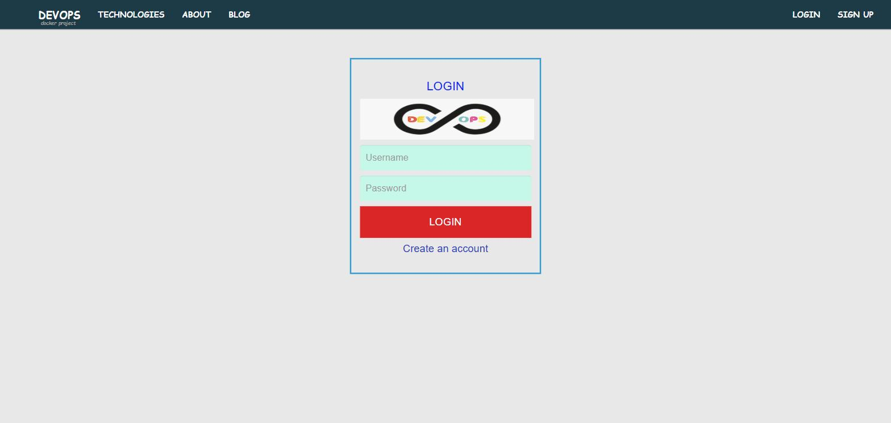

# Java Web Application — Docker Swarm and Kubernetes

[](https://hub.docker.com/r/dinesh78900/eks)
[](https://docs.docker.com/engine/swarm/)
[](https://kubernetes.io/)
[](https://spring.io/)

A Java Spring MVC application (Tomcat + MySQL + RabbitMQ) containerised and
deployed two ways: as a replicated **Docker Swarm** stack, and as a
**Kubernetes** workload with a StatefulSet-backed database.

## Container images

Both images are published on Docker Hub and referenced by the Swarm stack and
the Kubernetes manifests:

| Image | Used by | Docker Hub |
|---|---|---|
| `dinesh78900/eks:app` | `compose.yml`, `manifests/app-deployment.yml` | [dinesh78900/eks](https://hub.docker.com/r/dinesh78900/eks/tags) |
| `dinesh78900/eks:db` | `compose.yml`, `manifests/db-deployment.yml` | [dinesh78900/eks](https://hub.docker.com/r/dinesh78900/eks/tags) |

```bash
docker pull dinesh78900/eks:app
docker pull dinesh78900/eks:db
```

To rebuild from source:

```bash
mvn clean package                                  # produces target/vprofile-v2.war
docker build -t dinesh78900/eks:app -f Docker-app/Dockerfile .
docker build -t dinesh78900/eks:db ./Docker-db
docker push dinesh78900/eks:app && docker push dinesh78900/eks:db
```

> Both published images are built from the current source by the multi-stage
> Dockerfile above. `eks:app` contains `${MYSQL_ROOT_PASSWORD}` placeholders,
> not a compiled-in password, and is the exact image verified on `kind` under
> [Verified deployment](#verified-deployment).

## Verified deployment

Built and deployed on a local `kind` cluster (Kubernetes v1.36.1) from the
multi-stage Dockerfile in this repository.



| Check | Result |
|---|---|
| `devopsapp` Deployment | 2/2 Running |
| `devopsdb` StatefulSet | 1/1 Running, 0 restarts |
| `dbdata-devopsdb-0` PVC | Bound, 2Gi |
| Tomcat + Spring context | Started, WAR deployed, `/login` HTTP 200 |
| Schema from `db_backup.sql` | `user`, `role`, `user_role` — 7 user rows |
| Credentials in the deployed WAR | **0 occurrences** of the old password; placeholders only |
| Secret values against MySQL | Authenticate successfully |
| App pod → `devopsdb:3306` | Reachable |

Full output in **[docs/VERIFICATION.md](docs/VERIFICATION.md)**.

> **What this does and does not prove.** The deployed
> `application.properties` contains `${MYSQL_ROOT_PASSWORD:}` rather than a
> literal password, the Spring context starts without a placeholder-resolution
> error, no `Access denied` is ever logged, and the injected Secret values
> authenticate against MySQL from the app pod's own environment.
> What is *not* demonstrated is Spring opening a pooled connection under load —
> the connection pool is lazy and this application also expects RabbitMQ
> (`vpromq01`), memcached and Elasticsearch, none of which these manifests
> deploy. `/users` returns 500 for that reason, not a database one.

## Attribution

Application source from a DevOps course exercise (the `vprofile` Spring MVC
sample). **My work here:** the Docker images, the Swarm stack, the Kubernetes
manifests, and the hardening described under [Fixes applied](#fixes-applied).

## Stack

| Layer | Technology |
|---|---|
| Application | Java, Spring MVC, Tomcat 8 (JRE 11) |
| Database | MySQL 8.0 |
| Messaging | RabbitMQ (Spring AMQP) |
| Build | Maven (`pom.xml` → `vprofile-v2.war`) |
| Containers | Docker, multi-stage build |
| Orchestration | Docker Swarm (overlay network) and Kubernetes |
| Registry | Docker Hub — `dinesh78900/eks` |

## Repository layout

```text
├── Docker-app/
│   ├── Dockerfile          # Tomcat image, copies the built WAR
│   └── multistage/
│       └── Dockerfile      # Maven build + Tomcat runtime in one file
├── Docker-db/
│   ├── Dockerfile          # MySQL 8.0, seeds from db_backup.sql
│   └── db_backup.sql
├── manifests/
│   ├── app-deployment.yml  # Deployment + LoadBalancer Service
│   ├── db-deployment.yml   # StatefulSet + headless Service + PVC
│   └── secret.example.yml  # Template; real Secret created at deploy time
├── compose.yml             # Docker Swarm stack
├── pom.xml
└── src/
```

## Deploy — Docker Swarm

The `compose.yml` uses an **overlay** network and `deploy.replicas`, so it needs
Swarm mode rather than plain Compose:

```bash
docker swarm init

export MYSQL_ROOT_PASSWORD='<choose-a-strong-password>'
docker stack deploy -c compose.yml devops

docker stack services devops
docker service ps devops_application
```

The application is published on port `1111`, backed by 3 replicas behind Swarm's
built-in load balancer. Tear down with `docker stack rm devops`.

## Deploy — Kubernetes

```bash
# Credentials are never committed - create the Secret first
kubectl create secret generic devopsdb-secret \
  --from-literal=MYSQL_ROOT_PASSWORD='<choose-a-strong-password>' \
  --from-literal=MYSQL_DATABASE=accounts

# Private registry pull secret referenced by both manifests
kubectl create secret docker-registry flm \
  --docker-username=dinesh78900 \
  --docker-password='<docker-hub-token>'

kubectl apply -f manifests/db-deployment.yml
kubectl apply -f manifests/app-deployment.yml

kubectl get pods,svc,statefulset,pvc
```

## Fixes applied

The original course manifests deployed, but carried defects worth correcting:

| Issue | Impact | Fix |
|---|---|---|
| `ENV MYSQL_ROOT_PASSWORD="devopspassword"` in `Docker-db/Dockerfile` | Credential baked into a published image layer — directly under a `#dont expose passwords here` comment | Supplied at runtime from a Secret or the environment |
| StatefulSet had **no `serviceName`** | Required field; the manifest is invalid without it | Set to the headless Service `devopsdb` |
| StatefulSet named `devopsapp` — same as the Deployment | Two different workloads sharing one name; confusing to operate | Renamed to `devopsdb` |
| Database ran **`replicas: 2` with no volume at all** | Two MySQL pods with independent ephemeral state, diverging on every write, all data lost on restart | Single replica with a `volumeClaimTemplates` PVC at `/var/lib/mysql` |
| Everything labelled `app: swiggy` | Unrelated leftover on a Java Spring app | Relabelled `app: devopsapp` |
| `compose.yml` pulled `shaikmustafa/deepika:*` | Another account's images | Repointed to `dinesh78900/eks` |
| `mysql:5.7.25` (EOL October 2023) | Unpatched base image | Bumped to `mysql:8.0` |
| Container named `cont-1` | Uninformative | Named for its workload |
| No probes or resource limits | No health signalling; a pod could soak a node | Liveness/readiness probes and requests/limits on both workloads |
| `jdbc.password=devopspassword` in `application.properties` | Database password in source control | Resolved from `${MYSQL_ROOT_PASSWORD}` at startup |
| The multi-stage Dockerfile ran `git clone` on a **third-party repository** (`imranvisualpath/vprofile-repo`) and built that | The image never contained this repository's source, so every change made here — including moving the credentials out of `application.properties` — was silently excluded from the build | Rewritten to compile from local `pom.xml` and `src/`, with dependency resolution cached in its own layer |
| MySQL memory limit of `512Mi` | MySQL 8 is OOMKilled during InnoDB initialisation below ~768Mi | Raised to `512Mi` request / `1Gi` limit |

## Known limitations

- The Swarm stack publishes MySQL on `3306` to the host — fine for a lab, not for
  anything exposed.
- RabbitMQ is wired in `appconfig-rabbitmq.xml` via property placeholders but is
  not part of either deployment; the app runs without it.
- No Ingress or TLS — the Kubernetes Service is a plain `LoadBalancer`.
- No CI/CD in this repo. The Jenkins pipeline work lives in my
  [AWS EKS project](https://github.com/dinesh4567/AWS-Python-microservices-app).
- The application expects RabbitMQ, memcached and Elasticsearch, none of which
  these manifests deploy. Pages that depend on them (`/users`) return 500; the
  database path is unaffected.

## Next steps

- Add an Ingress with TLS instead of exposing a LoadBalancer directly
- Externalise MySQL credentials via Sealed Secrets or External Secrets Operator
- Package the manifests as a Helm chart
- Add a Jenkins pipeline with Trivy scanning, matching my other projects
